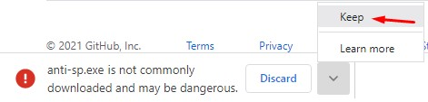
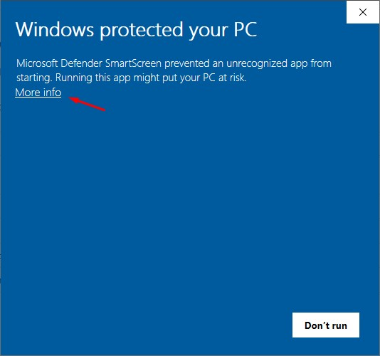

# anti-sp
Program created for binusian to minimalize the chance to fail classes because of absence, written purely in go.
This Program is inpired by [BimayInstantVicon](https://github.com/ayangd/BimayInstantVicon) which is made by [ayangd](https://github.com/ayangd).
So shout out to him and go checkout his projects.

## Installation
```
go install github.com/cocatrip/anti-sp@latest
```
Or, you can also download the executables directly from the [release page](https://github.com/cocatrip/anti-sp/releases)

## Usage
When first running `anti-sp`, `anti-sp` will ask for a username and password:
```
Username: <Your Bimay Username (without @binus.ac.id)>
Password: <Your Bimay Password>
```

Example:
```
Username: rayhan.noersandi
Password: mySecurePass!@#
```
The username and password will then be stored in your computer locally

### Credential
Your username and password will be stored locally in your computer inside the UserConfigDir. UserConfigDir is the default root directory to use for user-specific configuration data.
On Unix systems, it returns $XDG_CONFIG_HOME as specified by [freedesktop](https://specifications.freedesktop.org/basedir-spec/basedir-spec-latest.html) if non-empty, else $HOME/.config. On Darwin, it returns $HOME/Library/Application Support. On Windows, it returns %AppData%. On Plan 9, it returns $home/lib.

## Windows
For Windows user the exe file might be detected as a virus and can't be downloaded.
This happens because the `exe` file is not yet signed, to ignore this problem follow these steps:

- Press the arrow button and click `keep`.



- Select `More info` then the `Run anyway` button will show up.



- Press the `Run anyway` button.


